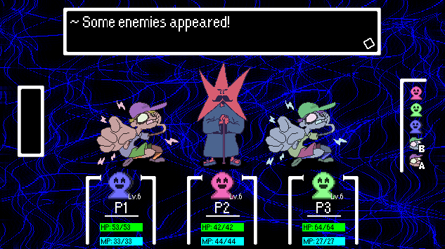
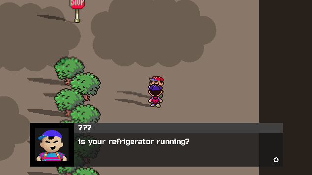
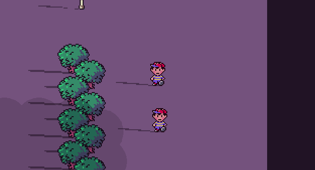

# Moonbeam RPG Engine
A 2D turn-based RPG engine made in GameMaker Studio 2.

## Features
- Cutscenes
- Story progression flags
- NPCs with changing dialog based on story flags
- Overworld enemies
- Turn-based battles with easily customizable encounters
- Leveling system for getting stronger and learning new attacks
- Random enemy colours
- Day/night cycle
- Wacky battle backgrounds using GLSL shaders

## Screenshots and GIFs

